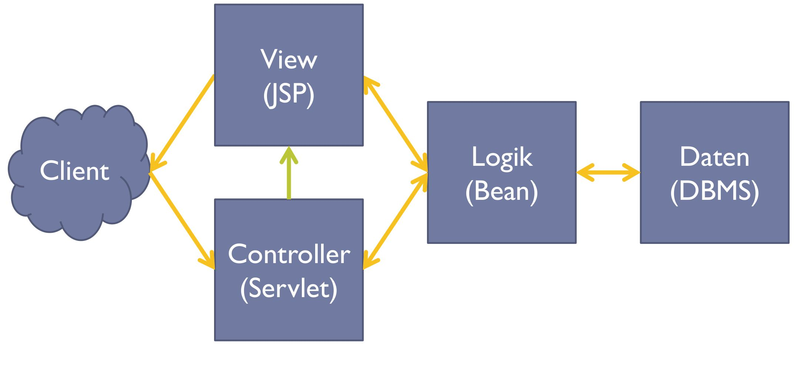
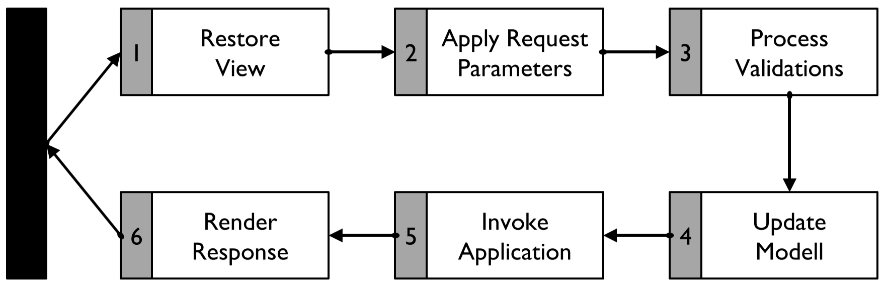

# JSP
## Grundlegendes
JSP's sind wie HTML-Dateien, jedoch darf darin Java-Code ausgeführt werden. Eine solche Datei mit der Endung .jsp wird vom Java-Compiler zunächst in eine Java-Klasse vom Typ *HttpServlet* und anschließend in den Java-Bytecode übersetzt. Der Servlet-Container sorgt dann dafür, dass dieser Bytecode vom Client wie normaler HTTP-Code aussieht und wie auch auf HTML-Seiten direkt darauf zugegriffen werden kann.
## Direktiven
```
<%@ direktive param*="value*" %>
```
### include
Einbinden einer anderen JSP<br>
Param: file - Dateiname
### taglib
Tag-Libraries einbiden (Erweiterungen wie JSTL)<br>
Params:
- uri - Pfad zum Taglib-Deskriptor
- prefix - Präfix um auf Taglib zuzugreifen
- tagDir - Unterverzeichniss von "/WEB-INF/tags"
### page
Informationen zur Seite<br>
Params (nur wichtigste):
- language - Sprache
- extends - Falls Oberklasse von HttpServlet verschieden
- pageEncoding - Codierung der Datei
- contentType - Rückgabetyp des Servlet-Containers zum Browser

Beispiel:
```java
<%@ page language="java" contentType="text/html" pageEncoding="UTF-8" %>
```
## Kommentare
### Kommentare die nicht im erzeugten HTML stehen
```
<%-- Kommentar --%>
```
### Kommentar im erzeugten HTML-Code
```
<!-- Kommentar -->
```
## Code-Snippets
Java-Code in Expressions und Skriptlets werden in Service-Routine des Servlets abgerufen. => Variablen nur für einen Seitenaufbau gültig! Gültigkeit verfliegt bei forward!
### Expressions
Java-Ausdruck ausführen.
```
<%= 4+5 %>
<%= request.getHeader("User-Agent") %>
```
### Skriptlets
Selbe wie Expressions, nur mehr als eine Expression.
```
<% while(true) { %>
    <h1>Overflow</h1>
<% } 
    String xy = "Hier kommt nie jemand hin;"%>
```
## Deklarationen
### Variablen
Instanzvariablendeklaration über Seitengrenze hinweg => bleiben über Servletlaufzeit bestehen
```
<%! int i = 4; %>
```
### Methoden
Wie Variablen nur anstatt Deklaration jetzt Methoden.
## Tags
Da Skriptlets unübersichtlich => Taglibs => Bibliotheken mit mehr Tags, die Code ausführen. Einbindung siehe [oben](#taglib).
```
<prefix:action attribut*="value*">
    content
</prefix:action>
```
### JSTL
Einbinden:
```
<%@ taglib prefix="c" uri="http://java.sun.com/jsp/jstl/core"%>
```
#### Variable setzen
```
<c:set var="x">5</c:set>
```
[Entspricht](#Variablen)
Zusätzlich kann Scope angegeben werden als attribut. 
#### Variable löschen
```
<c:remove var="x"/>
```
#### Variable ausgeben
```
<c:out value="x">5</c:set>
```
#### if
```
<c:if test="${name=="Peter"}">
    <span>Hallo Peterle</span>
</c:if>
```
## Expression Language
Zugriff auf Variablen in Attributen von Tags.
```
${x+5}
```
## Java Bean
```
<jsp:useBean id="AddressList" type="List" class="de.dhkarlsruhe.webengineering.beans.AddressList"></jsp:useBean>
```
Enstpricht
```java
List<Address> AddressList = new AddressList();
```
Scope kann als attribut festgelet werden.
### Get and Set
```
<jsp:setProperty name="Adress" property="street" value="1234"/>
<jsp:getProperty name"Address" property="street"/>
```
## Scopes
| Scope | Var | Class | ExpressionLang |
| ----- | --- | ----- | -------------- |
| Page | pageContext | PageContext | pageScope |
| Request | request | HttpServletRequest | requestScope|
| Session | session | HttpSession | sessionScope |
| Application | application | ServletContext | applicationScope|

# JavaScript
## DOM Manipulation
Zugriff auf HTML-Seite per *document*.
### Suchen eines Elements
```javascript
element = document.getElementById('id'); //Ein Element
elements = document.getElementsByName('name'); //Array of Elementen
```
### Node Manipulation
```javascript
firstChild = element.firstChild; //Erste Kind von element bekommen
firstChild.appendChild(elements[1]); //Kind hinzufügen
attributes = firstChild.getAttributes(); //Attribute von firstChild erhalten
```
## Event Handling
- onClick
- onFocus
- onChange
- onMouseOver
- ...
```javascript
element.addEventListener("click", function(event){/*do something*/});
```

## AJAX
Ruft Daten von RESTful oder SOAP-Services ab und verarbeitet diese.
```javascript
var req = new XMLHttpRequest();
req.open("GET", "www.wasauchimmer.de?param=xy", true);
//Event Handler für Request
req.onreadystatechanged = function receive(){
  if(req.stateChanged==4) answer = req.responseText;
}
//Erst hier eigentliches absenden des Requests
req.send();
```

# Benutzerverwaltung
## Sessions
Jedem Client wird eine Session-ID zugewiesen, diese kann unter Verwendung mehrerer Methoden erhalten werden. Sessions und wie sie gehandelt werden, wird vom Webserver gesteuert.
### URL-Rewriting
Session-ID ist stets in der URL zu finden
+ Client muss keine Cookies unterstützen
- Session-ID gut sichtbar
- Gefahr des Session-Ridings
- Keine Speicherung der URL als Favorit möglich
- Beschränkte Größe der URL
### Cookies
Session-ID wird im Cookie des Browser gehalten
+ Nicht offensichtlich sichbar und auslesbar
+ Wird nicht in Favoriten mitgespeichert
- Broswer muss Cookies unterstützen

# Wunschliste
## Controller
- Einlesen der Parameter (Zuordnen der Parameter zu Modelleigenschaften)
- Prüfen der Parameter (anhand Modelleigenschaften)
- Falls Prüfung korrekt
  - Konvertieren
  - Daten in Modell übernehmen
  - Aktion auslösen
  - Folgeseite auswählen und aufrufen
- Falls nicht
  - Fehlermeldung

## Framework
- Automatische Typprüfung von Eingaben
- Automatische Konvertierung der Daten
- Automatische Zuordnung von Parametern an Beans
- Verwaltung von Fehlermeldungen
- Konfiguration der Folgeseiten

Eine mögliche Lösung => [Java Server Faces](#java-server-faces)

# JSF Commands
## <f:view>
Wrapper für JSF-Komponente, mit ID für Navigation.

**Attribute:**
- contentType
- encoding
- locale
- afterphase
- beforephase
- renderKitId

<a id="allH" name="allH"></a>
## All <h:xxx>
**Attribute:**
- id
- rendered
- escape
- title
- style
- styleClass

## <h:outputText>
Ausgabe von Text 

**Attribute (extends [all](#allH)):**
- value *(auszugebender Text)*

## <h:form>
Erzeugt HTML-Fomular.

**Attribute (extends [all](#allH)):**
- value *(auszugebender Text)*

## <h:outputLabel>
Erzeugt HTML-Label.

**Attribute (extends [all](#allH)):**
- for *(siehe HTML label element)*

## <h:inputText>
Erzeugt HTML-Fomular.

**Attribute (extends [all](#allH)):**
- value *(Value-expression für Zugriff auf Bean)*
- validator
- validatorMessage
- converter
- converterMessage
- required
- requiredMessage

## <h:commandButton>
HTML-Fomular absenden.

**Attribute (extends [all](#allH)):**
- value *(auszugebender Text)*
- action *(auszuführende Methode)*
- actionListener

## <h:panelGrid>
Spaltenweises Anordnen von Kindselementen

**Attribute (extends [all](#allH)):**
- columns *(Anzahl spalten)*
- cellspacing
- cellpadding

## <h:message>
Ausgabe Fehlermeldung Validator oder Konverter.

**Attribute (extends [all](#allH)):**
- for *(id des Input-Elements für das die Nachricht anliegt)*
- showDetail, showSummary
- warnStyle, warnClass
- errorStyle, errorClass
- fatalStyle, fatalClass

# JSF-Navigation
Folgeseiten können in *faces-config.xml* festgelegt werden.
```xml
<navigation-rule>  
  <from-view-id>/page1.xhtml</from-view-id>   <navigation-case>
    <from-outcome>resultString</from-outcome>
    <to-view-id>/page2.xhtml</to-view-id>
  </navigation-case>
</navigation-rule>
```

## \<navigation-rule>
Klammer um eine Regel
### \<from-view-id>
View, von der die Regel ausgeht
### \<display-name>
Klarname für Werkzeuge
### \<description>
Beschreibung für Werkzeuge.
### \<navigation-case>
Navigations-Fall
- \<display-name> *Klarname für Werkzeuge*
- \<description> *Beschreibung für Werkzeuge*
- \<from-outcome> *Ergebniss der Aktion*
- \<from-action> *Text der Aktion*
- \<to-view-id> *Ziel-View (relativ)*
- \<redirect> *Redirect statt Forward*


-----------------------------------

# Zusammenfassung Web-Engineering 2016 (Parallelkurs)

<aside>
<!-- TOC -->

- [Zusammenfassung Web-Engineering 2016](#zusammenfassung-web-engineering-2016)
	- [HTTP](#http)
		- [Request](#request)
		- [Response](#response)
		- [Aufbau URI](#aufbau-uri)
		- [Relative URL](#relative-url)
		- [Transfer-Encoding:Chunked](#transfer-encodingchunked)
	- [Sessions](#sessions)
		- [Lastverteilung](#lastverteilung)
	- [Sicherheit](#sicherheit)
	- [JSP](#jsp)
	- [Auth](#auth)
		- [HTTP Auth](#http-auth)
		- [Form-Based](#form-based)
		- [Certification-Based Mutual Auth](#certification-based-mutual-auth)
		- [User Name-and Password-Based Mutual Authentication](#user-name-and-password-based-mutual-authentication)
	- [Benutzerverwaltung](#benutzerverwaltung)
		- [Serverbezogene Benutzerverwaltung](#serverbezogene-benutzerverwaltung)
	- [Java Server Faces](#java-server-faces)
		- [faces-config.xml](#faces-configxml)
		- [Scopes:](#scopes)
		- [Views in XHTML Dateien](#views-in-xhtml-dateien)
			- [Snippets](#snippets)
		- [Allg. Attribute für <h:xxxx>](#allg-attribute-für-hxxxx)
		- [Eigener Validator](#eigener-validator)
		- [Eigener Konverter](#eigener-konverter)
	- [AngularJS](#angularjs)
		- [Controller](#controller)
		- [Dependency Injection](#dependency-injection)
	- [Vaadin](#vaadin)

<!-- /TOC -->
</aside>

## HTTP
Hypertext Transfer Protocoll überträgt Daten über TCP nach dem Request-Response Prinzip. Es werden somit keine Daten ohne Anfrage gesendet. Das Protokoll ist prinzipiell zustandslos, dies kann aber mit Sessions überwunden werden. 

### Request
Erste Zeile: ``Methode URI Protokoll`` Bsp: `GET /site.html HTTP/1.1`

Es können weitere Zeilen (Request Header Fields) mit ``Key:Value``, getrennt durch \r\n folgen.
<br>Bsp: ``Accept-Language: en-US``

Methoden: GET, POST, HEAD, PUT, DELETE, PATCH, TRACE, OPTIONS, CONNECT
<br>In der Praxis werden häufig nur GET und POST verwendet.
<br>Server können auch eigene definieren

<a id="markdown-response" name="response"></a>
### Response

Erste Zeile: ``Protokoll StatusCode StatusText``

Es folgen Response Header Fields. Daraufhin stehen nach einer Leerzeile zur Trennung von den Metadaten die "echten" zu übertragenen Daten, z.B. das HTML einer Seite oder ein Bild.

```
HTTP/1.1 200 OK
Date: Mon, 27 Jul 2009 12:28:53 GMT
Server: Apache/2.2.14 (Win32)
Last-Modified: Wed, 22 Jul 2009 19:15:56 GMT
Content-Length: 88
Content-Type: text/html
Connection: Closed

<html>
<body>
<h1>Hello, World!</h1>
</body>
</html>
```

<a id="markdown-aufbau-uri" name="aufbau-uri"></a>
### Aufbau URI

``Schema://Server:Port/Pfad?Anfrage#Fragment


| Typ      | Beschreibung              | Beispiel             | Default                 |
|----------|------------------------------------|----------------------|-------------------------|
| Schema   | meist Übertragungsprotokoll        | http, ftp            | -                       |
| Server   | Domain, ipv4-Adresse               | google.de, 127.0.0.1 | -                       |
| Port     | Anzusprechender Port               | 80, 443, 9000        | Standardport von Schema |
| Pfad     | Zeichenkette ohne ?, Trenner ist / | /public/bild.jpg     | /                       |
| Anfragen | Key=Value Paare, Trenner ist &     | name=Alex&age=28     |                         |
| Fragment | Element der Zielseite              | #Abstract            |                         |
alle Teile ab inkl. Port sind optional

<a id="markdown-relative-url" name="relative-url"></a>
### Relative URL

| Präfix  | Aktion                         | Beispiel            |
|---------|--------------------------------|---------------------|
| ``/``   | selber Schema, Server und Port | ``/next.html``      |
| ``//``  | selbes Schema                  | ``//www.google.de`` |
| ``#``   | gehe zu Element                | ``#Abstract``       |
| ``./``  | gleicher Pfad                  | ``./bild.jpg``      |
| ``../`` | pfad nach unten                | ``../images/a.jpg`` |

Sonderzeichen müssen in ``%ASCII``, ``%UTF-8`` (2 st) oder ``%uUnicode`` (4st) konvertiert werden 

### Transfer-Encoding:Chunked
Die erste Zeile enthält die Länge des Brockens hexadezimal.
(Ohne diese Zeile und die schließende Leerzeile)
Die mittleren Zeilen enthalten den eigentlichen Inhalt.
Die letzte Zeile ist eine Leerzeile.
Als Abschluss folgt ein leerer Brocken.

Bsp:
```
6\r\n
Wiki\r\n ←
\r\n
7\r\n
pedia\r\n ←
\r\n
0\r\n
\r\n
```

## Sessions

Client erhält eine ID, der Server hinterlegt Daten an diese.

SessionID in URL<br>
\+ muss keine Cookies unterstützen<br>
\- gut sichtbar<br>
\- keine Speicherung<br>
\- beschränkte Größe der URL

<a id="markdown-lastverteilung" name="lastverteilung"></a>
### Lastverteilung

muss dem gleichen Server immer den gleichen Server zuordnen => doof

oder: zentrale Verwaltung der SessionIDs


| Sitzungsgebunden                  | Sitzungsungebunden           |
|-----------------------------------|------------------------------|
| Einfach, schnell                  | Komplex                      |
| Sitzungsdaten lokal gehalten      | Sitzungsdaten im Hintergrund |
| Ausfall Server => Ausfall Sitzung | Ausfall Server => unbemerkt  |

Mischform: Bildung von Gruppen mit ungebundenen Sitzungen
- Bei einem (geplanten) Ausfall werden alle Sitzungsdaten auf einen anderen Server geleitet

<a id="markdown-sicherheit" name="sicherheit"></a>
## Sicherheit

| Angriff                   | Beschreibung                                                                                                     | Lösung                                      |
|---------------------------|------------------------------------------------------------------------------------------------------------------|---------------------------------------------|
| Request Manipulation      | Client ändert URL Zeile manuell                                                                                  | Server überprüft Zugriffsrechte  auf jeder Seite            |
| Directory Traversal | Ändern des Pfads um aus Anwendungsverzeichniss auszubrechen | Verwendung von Schlüsseln; kanonischen Pfad berechnen |
| SQL Injection             | Client schickt SQL Statement über Eingabeparameter                                                                                    | Eingaben encodieren, Stored Procedures, JDBC-Driver lassen mehrere Befehle auf einmal nicht zu, Strukturbestandteile des SQLs nicht über Parameter übergebbar.; Prepared Statements      |
| E-Mail Injection          | Client trägt mit \n mehrere E-Mails ein => Diese Email-Adressen werden in BCC eingertagen und somit an beliebig viele Leute gechickt => Spam-Mails                                                                        | \n verhindern                               |
| Cross-Site-Scripting      | Client fügt `<script>` in Nachricht ein => reflektiert (in Seite eingebaut) / persistent (Schadcode in DB abgelegt) / lokal (Schadcode nur auf lokalem Rechner)                                                                  | <> encodieren zu unicode, Tags whitelisten (Falls nicht benötigt)          |
| Cross-Site-Request-Forgey | Client fügt `<script>` in eine Nachricht ein, die Aktion bei anderen ausführt (z.B. abmelden, trojaner umleiten) | s.o.<br>Wenn wichtig: TAN                   |
| Session Hijacking         | Session-ID wird ausgespäht und gekapert                                                                          | TAN, PW ändern nur mit Eingabe des alten PW |
| Man-In-The-Browser        | Angreifer/Schadcode direkt beim Client und manipuliert gezielt HTML der Webseiten, sodass der Nutzer keinen Verdacht schöpft. Bsp: Online-Banking Manipulation einer Überweisung auf Angreifer-Konto ohne dass Nutzer das sieht & anschließend Manipulation des Kontostandes, um keinen Verdacht zu Schöpfen.  | 2-Wege-Auth ; Einfallsmöglichkeiten absichern                              |
| Man-In-the-Middle         | Nutzer wird auf gefälschte Seite weitergeleitet (mit gleichem Aussehen etc.) & schickt requests sogar an originalen Server | HTTPS, 2-Wege-Auth                      |
| Phishing                  | Abfischen von Zugriffsdaten über Fake Webseite die über Spam E-Mails kommen                                                  | gebundene TAN, 2-Wege, Aufklärung           |
| Denial-of-Service         | Server mit Anfragen überfluten                                                                                   | Muster erkennen und nicht reagieren         |

<a id="markdown-jsp" name="jsp"></a>
## JSP

Model 1: Client ↔ View/Controller (JSP) ↔ Logik (Bean) ↔ Daten (DBMS)

Model 2:

- Client ruft Controller (Servlet) auf
- Controller wählt Aktion und übergibt diese an die View
- View generiert Antwort und sendet diese an den Browser
- Controller und View kommunizieren mit der Logik (Bean)
- Bean kommuniziert mit DBMS

Weiterleitung:
- Redirect: Browser wird auf neue URL geleitet
- Forward: Weiterleitung innerhalb von Server (kein URL wechsel)

Scopes:
- Page Scope: aktuelle Seite
- Request Scope: wie Page, aber mit Forward, Include, Error Pages
- Session: Sessiondaten => Achtung beim Einzatz paralleler Server
- Application: Anwendungsweit (z.B. Caches)

```xml
<c:set var="»varname«" scope="»scope«">Value</c:set>
<c:out value="${»varname«}"><c:out>
<c:out value="${»scope«Scope}.»varname«"><c:out>
```
wenn eindeutige Variablen: Scopewahl automatisch

Gültigkeitsbereich einer JavaBean bei Erzeugung

```xml
<jsp:useBean id="»name«" class="»classname«" scope="»scope«"></jsp:useBean>
```

<a id="markdown-auth" name="auth"></a>
## Auth

<a id="markdown-http-auth" name="http-auth"></a>
### HTTP Auth
unsicher, da bei jedem Aufruf Daten Base64 übertragen

<a id="markdown-form-based" name="form-based"></a>
### Form-Based 
nur einmal, aber immer noch unverschlüsselt

<a id="markdown-certification-based-mutual-auth" name="certification-based-mutual-auth"></a>
### Certification-Based Mutual Auth
Client und Server besitzen einen Keystore sowie eine Referenz auf einen TrustStore

1. Client fordert Ressource von Server an
2. Server gibt Client sein Zertifikat
3. Client verifiziert Zertifikat über gemeinsamen TrustStore
4. Client gibt Server sein Zertifikat
5. Server verifiziert Zertikikat über gemeinsamen TrustStore
6. Client erhält Zugriff auf geschützte Ressource

<a id="markdown-user-name-and-password-based-mutual-authentication" name="user-name-and-password-based-mutual-authentication"></a>
### User Name-and Password-Based Mutual Authentication 

1. Client fordert Ressource von Server an
2. Server gibt Client sein Zertifikat
3. Client Verifiziert Zertifikat
4. Client sendet Benutzername/Passwort zum Server
5. Server verifiziert Daten
6. Client erhält Zugriff auf die geschützte Ressource

<a id="markdown-benutzerverwaltung" name="benutzerverwaltung"></a>
## Benutzerverwaltung

<a id="markdown-serverbezogene-benutzerverwaltung" name="serverbezogene-benutzerverwaltung"></a>
### Serverbezogene Benutzerverwaltung

Webserver verwaltet Liste an Logins und Benutzergruppen und prüft diese

Tomcat: Benutzer in `tomcat-users.xml` eintragen
```xml
<tomcat-users>
  <role rolename="kunde"/>
  <role rolename="administrator"/>
  <user username="maier" password="x2f" roles="kunde"/>
  <user username="tim" password="mit" roles="kunde"/>
  <user username="fritz" password="zeitlos" roles="administrator, kunde"/>
</tomcat-users>
```

In `web.xml`
```xml
<security-role><role-name>myRole</role-name></security-role>
<security-constraint>
  <web-resource-collection>
    <web-resource-name>all</web-resource-name>
    <url-pattern>/*</url-pattern>
  </web-resource-collection>
  <auth-constraint>
    <role-name>myRole</role-name>
  </auth-constraint>
  <user-data-constraint>
    <transport-guarantee>NONE</transport-guarantee>
  </user-data-constraint>
</security-constraint>
```

Realm `UserDatabase` in `server.xml` anpassen (z.B. Datenbank, LDAP)

Im Formular:
- action: `j_security_check`
- method: `post`
- user: `j_username`
- password: `j_password`

Vorteile: 
- zentrale Benutzerverwaltung
- Sicherheit durch Server geleistet
- Anwendungsübergreifende Anmeldung
- Geringerer Aufwand

Nachteile:
- Rollen müssen in Anwendung bekannt sein
- Detaillierungen der Rechte müssen in der Anwendung gepflegt werden

`request.getRemoteUser()` gibt Benutzernamen als String zurück
<br>EL: `${request.remoteUser}` (Tomcat < 7)
<br>EL: `${pageContext.request.remoteUser}`
<br>`request.isUserInRole(String role)`
<br>EL: `${pageContext.request.isUserInRole('»role«')}`

<a id="markdown-java-server-faces" name="java-server-faces"></a>
## Java Server Faces

Idee: Sich wiederholenden Code und Abläufe automatisieren

Lebenszyklus:


1. **Restore View** - Wiederherstellen des Komponentenbaumes der View
2. **Apply Request Parameters** - Übergabeparameter lesen
3. **Process Validation** - Sind die Parameter korrekt?
4. **Update Model Values** - Parameter in Model (Bean) schreiben
5. **Invoke Application** - Geschäftslogik ausführen
6. **Render Response** - Antwort auswählen und ausgeben
Es müssen nur die letzten beiden Schritte programmiert werden

Initialer Aufruf: Client → 1) → 6) → Client, da nichts zu verarbeiten

Falsche Eingabe: Client → 1-3) → 6)

<a id="markdown-faces-configxml" name="faces-configxml"></a>
### faces-config.xml

In der `faces-config.xml` wird die komplette Steuerung der Anwendung angelegt
- Registrierung von *Beans* unter einem Namen und Scope. Bei Verwendung in der Expression-Language wird die Bean automatisch erzeugt
- Festlegung der möglichen Folgeview über "result Strings"
- Registrierung von Anwendungsweiten *Convertern* und *Validatoren* unter einem Namen
- *Navigation*
- *Listener*

Alternativ existiert die Verwendung von Annotationen. Beans werden mit @ManagedBean gekennzeichnet und müssen eine weitere Annotation zur Zuweisung des Scopes besizen. Standardname der Bean ist initial Lowercase

<a id="markdown-scopes" name="scopes"></a>
### Scopes:

|Name|Annotation|Eigenschaften|
|-|-|-|
|applicaiton|@ApplicationScoped|erstellt bei erstem Aufruf, lebt bis Serverstop|
|session|@SessionScoped|erstellt bei erster Verwendung, lebt bis Session invalidate|
|view|@ViewScoped|erstellt bei Request, lebt bis Benutzer auf anderer View|
|request|@RequestScoped|erstellt bei Request, lebt bis Response|

<a id="markdown-views-in-xhtml-dateien" name="views-in-xhtml-dateien"></a>
### Views in XHTML Dateien

In der View ist nun jsf-core (f:) und jsf-html (h:) registriert

`\${expr}`: Expression wird während _Restore View_ ausgewertet. Nur lesender Zugriff. Kein `\${bean.method()}`<br>
`#{expr}`: Je nach Phase get oder set

Erlaubt: `#{bean.method()}`. Signatur und Übergabeparameter werden durch Art der Verwendung bestimmt.

<a id="markdown-snippets" name="snippets"></a>
#### Snippets

Beans:<br/>
Per Annotation:
```java
@ManagedBean
@ViewScoped
public class SayHelloBean () {...}
```
In config:
```xml
<managed-bean>
  <managed-bean-name>sayHelloBean</managed-bean-name>
  <managed-bean-class>demo.sayHelloBean</manages-bean-class>
  <manages-bean-scope>view</manages-bean-scope>
</managed-bean>
```

Ausgabe einer CRUD-Tabelle
```xml
<h:link value="Neuer Eintrag" outcome="new" />
<h:dataTable value="#{addressList.list}" var="i" border="1" cellpadding="10">
  <h:column>
    <f:facet name="header">
      <h:outputText value="»Spaltenname«"/>
    </f:facet>
    <h:outputText value="#{i.name}" />
  </h:column>
  <h:column>
    <f:facet name="header"><h:outputText value="Aktion"/></f:facet>
    <h:link value="B" outcome="edit">
      <f:param name="id" value="#{i.id}"></f:param>
    </h:link>
    <h:form>
      <h:commandLink value="X" action="#{i.delete()}"></h:commandLink>
    </h:form>
  </h:column>
</h:dataTable>
```

Aufbau Formular
```xml
  <f:metadata>
    <f:viewParam name="id" value="#{address.id}"></f:viewParam> <!-- In setId() steht die Selektierung aus der Datenbank -->
  </f:metadata>
</head>
<body>
  <h:form>
    <h:panelGrid columns="2" cellspacing="10">
      <h:outputLabel for="name" value="Name" />
      <h:inputText id="name" value="#{address.name}" required="true"></h:inputText>

      <h:outputLabel for="number" value="Hausnr" />
      <h:inputText id="number" value="#{address.number}" converter="javax.faces.Integer"></h:inputText>
      
      <h:commandButton value="Abschicken" action="#{address.save()}"></h:commandButton>
    </h:panelGrid>
    <h:messages />
  </h:form>
```

<a id="markdown-allg-attribute-für-hxxxx" name="allg-attribute-für-hxxxx"></a>
### Allg. Attribute für <h:xxxx>


| Attribut                 | Beschreibung                                        |
|--------------------------|-----------------------------------------------------|
| `rendered="#{…}`         | nur Anzeige wenn Bedingung == true                  |
| `validator="»method()«"`<br>`validator="»name«` | eigenen Validierer setzen                           |
| `converter`              | Converter setzen     |
| `required`               | Pflichtfeld true/false |
| `[required|converter|validator]Message`| Pflichtfeld bei Pflichtfeld nicht gesetzt |

In Bean keine Logik in die Getter, da diese ungewollt in der Phase _Apply Request Parameters_ aufgerufen werden

Begriff _BackingBean_: Getter und Setter keine Logik, keine DB Zugriffe, Navigation über JSF Strings

normale Datentypen (primitive, Date, Enum) besitzen bereits Standardconverter

<a id="markdown-eigener-validator" name="eigener-validator"></a>
### Eigener Validator
- `<f:validator validatorId="IdofMyValidator" />` zwischen Tags des Eingabefeldes
- Klasse, die `Validator` erweitert und Methode `validate(FacesContext,UIComponent,Object value)` implementiert
- Klasse wird in der `faces-config.xml` mit der gewünschten Id verbunden
  - oder Annotation `@FacesValidator("IDofMyValidator")`


<a id="markdown-eigener-konverter" name="eigener-konverter"></a>
### Eigener Konverter

Eigene Konverter können unter einer ID (value/id) oder für einen Typ (forClass) gespeichert werden. Realisieren das Interface Converter und implementieren die Methoden `getAsString` und `getAsObject`

<a id="markdown-angularjs" name="angularjs"></a>
## AngularJS

MVC im Client

Two-Way-Databinding: Verbindung zwischen Model und View ist lesend und schreibend über einen einzelnen Ausdruck


| Angular    | Beschreibung                     |
|------------|----------------------------------|
| `ng-app`   | Markierung Wurzelelement         |
| `ng-model` | Namen für `<input` vergeben      |
| `ng-view`  | hier wird ein Template eingefügt |

Module enthalten Controller, Services, Direktiven, Filter

Neues Modul: 
```javascript
var helloWorldApp = angular.module('«nameDesModules»', [/*Namen abhängiger Module*/]);
```

<a id="markdown-controller" name="controller"></a>
### Controller
Controller Verbindet Model und View. Dieses wird über `$scope` aktualisiert

Controller erstellen:
```javascript
helloWorldApp.controller('helloWorldController', function($scope) {
  $scope.hello = 'Hello World from Controller!';
});
```

im View:
```html
<div ng-controller="rechnerController">(...)</div>
```

`$watch` registriert einen Listener auf eine Expression, welche bei jeder Änderung aufgerufen wird

```javascript
// jedes Mal, wenn x+y sich ändert, aktualisiere Variable res
\$scope.$watch("x+y", function () {
  \$scope.res = 1*\$scope.x + 1*\$scope.y;
});
```

<a id="markdown-dependency-injection" name="dependency-injection"></a>
### Dependency Injection

Modul braucht Modul "$log":
```javascript
var myApp = angular.module("myApp", ["$log"]);
```

Korrekte Schreibweise Controller:

```javascript
app.controller("myController", ["\$scope", function(\$scope) {
  // ...
}])
```

Die Strings der zu inizierenden Objekte in der zu verwendenden Reihenfolge => Code ist minimierbar

HTTP:
```javascript
\$http.get("»url«").success(function(data) {
  // show data
}).error(function() {
  // show error message
})
```

Modular mit ng-view

```javascript
var app = angular.module("appViews", ['ngRoute']);

app.config(['routeProvider', function($routeProvider) {
  $routeProvider.when('»url«/:»param«', {
    templateUrl: '»template.html«',
    controller: '»controller«'
  }).otherwise({
    redirectTo:'»url«'
  })
}]);
```

Parameter im Controller: `$routeParams.param`


<a id="markdown-vaadin" name="vaadin"></a>
## Vaadin

- Komplette Software wird in Java Entwickelt
- Abstraktion der Aufteilung zwischen Server und Client
- Abstraktion Unterschiede Browser
- Nur die Startseite wird "klassisch" aufgerufen. Alles andere über JS
- Baut auf GWT (Google Web Toolkit) auf

In Vaadin wird erst konvertiert, dann validiert => die Konverter validieren ein bisschen mit

Binden Attribute einer Bean an Elemente des UI:
1. `new BeanFieldGroup<Bean>(Bean.class)` Gruppe erstellen 
2. `group.setItemDataSource(bean)` Bean festlegen
3. `layout.addComponent(group.buildAndBind("»label«", "»beanAttribute«"))` layout bauen 

Attribute neu auslesen mit `group.discard()`

Eigene UI mit `group.setFieldFactory(FieldGroupFieldFactory)`
1. `DefaultFieldGroupFieldFactory` erweitern
2. `public <T extends Field> T createField(Class<?> type, Class<T> fieldType)` überschreiben
3. anhand der Parameter zu ändernde Elemente auswählen => `Class.isAssignableFrom`

Vorteile:
- mächtige GUI-Elemente
- Nur eine Sprache
- Programmierung wie auf dem Desktop

Nachteile:
- Mangelnde Barrierefreiheit
- Indizierung von Suchmaschinen
- komplexe Anpassung/Erweiterung
- komplexe Fehlersuche


